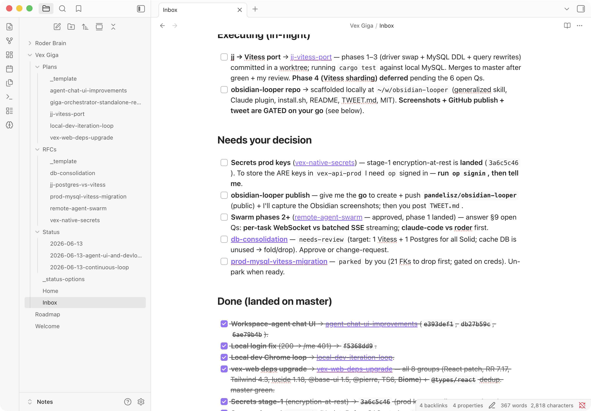
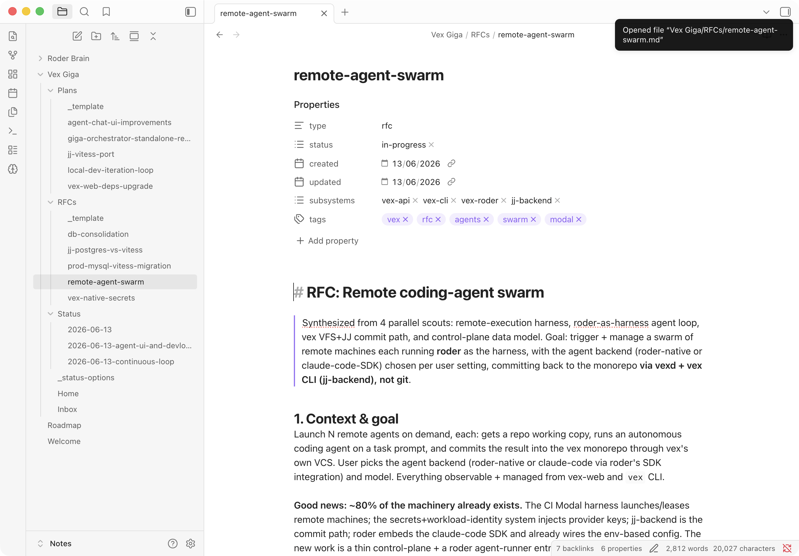
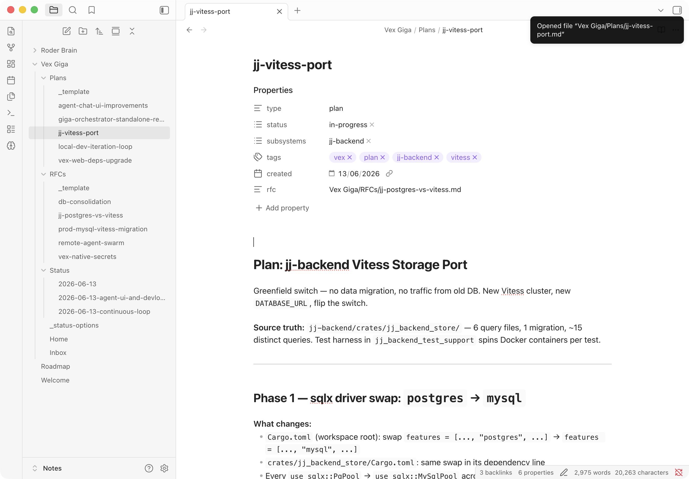
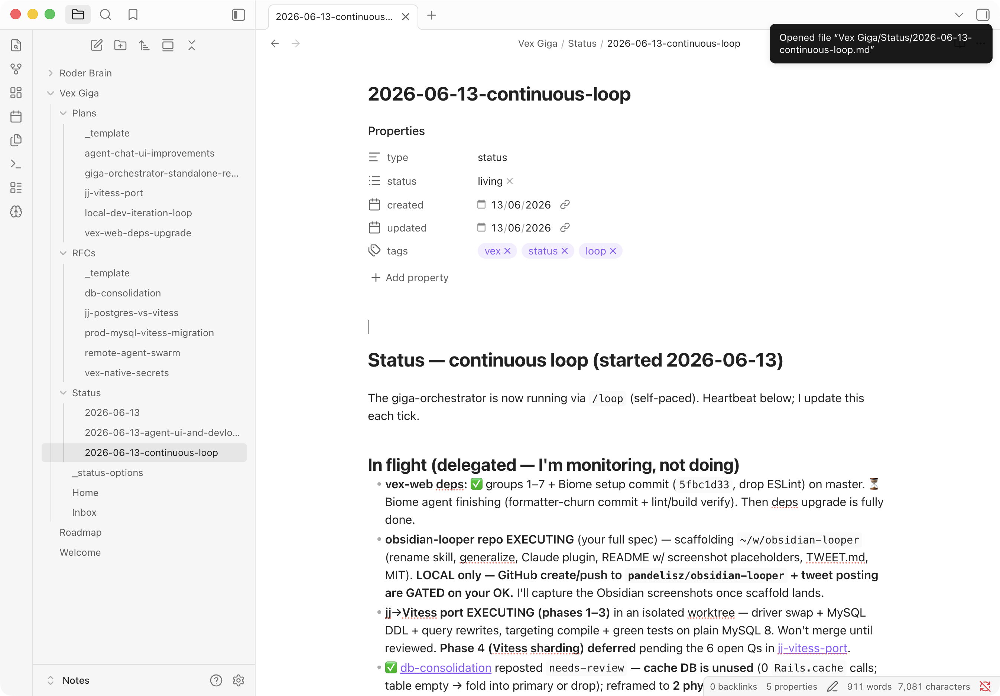

# obsidian-looper

**Orchestrate Claude Code at scale, with Obsidian as the shared brain.**

obsidian-looper is a Claude Code skill that turns your Obsidian vault into a live control plane for a fleet of AI sub-agents. You drop work into `Inbox.md`, approve plans with a click, and the orchestrator handles the rest — scouting your codebase, drafting RFCs, dispatching parallel implementer agents, verifying their output, and reporting back — all without you typing another message to Claude.



---

## The idea

Most "agentic" workflows still require you to babysit Claude turn-by-turn. obsidian-looper flips this: Claude runs a **continuous loop** against your Obsidian vault, and *you* steer by editing notes.

The key insight is that Obsidian's frontmatter `status` property — displayed as a chip-picker — becomes a **signalling protocol**. You set `status: [approved]` on a Plan, and on the next tick the orchestrator dispatches a fleet of sub-agents to execute it. You set `status: [changes-requested]` and write a comment under `## Review`, and the orchestrator picks it up, revises the draft, and flips it back to `needs-review`. You never need to re-open a terminal or say anything to Claude.

Meanwhile, Claude is running as an **Opus conductor** — it never does the leaf work itself. Every grep, file read, implementation, and test run goes to a specialized sub-Claude (Haiku for lookup, Sonnet for implementation, nested Opus for complex sub-orchestration). The conductor's only jobs are: keep Obsidian accurate, dispatch the fleet, and synthesize results.

---

## Concepts

### The Obsidian brain

Your vault hosts a dedicated folder (e.g. `My Project Giga/`) that the orchestrator reads and writes via the [`mcp-obsidian`](https://github.com/MarkusPfundstein/mcp-obsidian) MCP server and the Obsidian Local REST API plugin. Changes appear in your vault in real time.



The folder contains:
- **`Inbox.md`** — your asks, as `- [ ]` checkboxes. The orchestrator drains this each tick.
- **`RFCs/`** — design decisions and proposals. Claude drafts them; you approve or request changes.
- **`Plans/`** — scoped execution plans linked to an RFC. Approving a Plan triggers execution.
- **`Status/`** — dated heartbeat notes. One per day, updated each loop tick.
- **`Roadmap.md`** — rolling priorities the orchestrator uses to triage inbox items.

### The status-frontmatter review loop

Every RFC and Plan has a `status` frontmatter property. Because it's typed as an Obsidian **List**, it renders as a chip-picker — no markdown editing required.



The flow:
```
draft → needs-review → approved | changes-requested → in-progress → done
```

- Claude writes `draft`, flips to `needs-review` when ready.
- **You never get pinged** — just open Obsidian when you want to review.
- You click the chip. If `approved`, Claude executes on the next tick. If `changes-requested`, you write a comment under `## Review` and Claude revises.

### The continuous `/loop`

Start the orchestrator with:
```
/loop /obsidian-looper run the continuous loop
```

Every tick (self-paced, faster when busy, slower when idle):
1. **Monitor the fleet** — check in-flight agents, persist results to Obsidian.
2. **Advance approved work** — dispatch implementing agents for approved Plans.
3. **Drain the inbox** — scout, classify, and draft RFCs/Plans from open Inbox items.
4. **Write the heartbeat** — update today's `Status/` note with the current picture.



Interrupt (Ctrl-C or close the session) to stop. The loop is local-session-only — it needs the running Obsidian REST API and Claude's ability to spawn agents.

### Delegate, don't do it yourself

The orchestrator is a **conductor, not a player**. If it catches itself reading the 4th file, grepping the codebase, or writing an implementation — that's a bug in the orchestration. Everything substantive goes to a sub-Claude:
- **Haiku + Explore** for search and lookup
- **Sonnet** for implementation and drafting
- **Opus (inherited)** for judgment, synthesis, and sub-orchestration

### Model tiers

| Tier | Model | Use for |
|------|-------|---------|
| Finder | `haiku` | grep, file location, "does X exist?", list-building |
| Workhorse | `sonnet` | implementation, edits, test writing, focused review |
| Orchestrator | `opus` (inherit) | planning, decomposition, cross-subsystem synthesis |

---

## Quickstart

### Prerequisites

- [Claude Code](https://docs.anthropic.com/claude-code) CLI
- [Obsidian](https://obsidian.md/) desktop app (free)
- Node.js (for `npx mcp-obsidian`)

### 1. Clone

```bash
git clone https://github.com/YOUR_USERNAME/obsidian-looper ~/tools/obsidian-looper
```

### 2. Install into your project

```bash
cd ~/tools/obsidian-looper
./install.sh /path/to/your-project
```

This copies the skill into `.agents/skills/obsidian-looper/` and `.claude/skills/obsidian-looper/`, and drops a `project.config.js` stub.

### 3. Configure

Edit `/path/to/your-project/.agents/skills/obsidian-looper/project.config.js`:

```js
export default {
  obsidian: {
    vaultRoot: '/Users/you/Documents/Obsidian/Notes',
    gigaFolder: 'My Project Giga',
  },
  git: {
    mainBranch: 'main',
    usePRs: true,
  },
  subsystems: [
    { name: 'backend',  path: 'backend/',  stack: 'Rails 8',  verifyCmd: 'bin/rails test' },
    { name: 'frontend', path: 'frontend/', stack: 'Next.js',  verifyCmd: 'pnpm build' },
  ],
  guardrails: [
    'No raw SQL in models — use scopes.',
  ],
}
```

### 4. Set up Obsidian

Follow [obsidian-setup/README.md](obsidian-setup/README.md):
1. Install the **Local REST API** community plugin.
2. Add `mcp-obsidian` to your Claude Code MCP config.
3. Copy `obsidian-setup/vault-scaffold/` into your vault under your `gigaFolder` name.
4. Merge `obsidian-setup/types-patch.json` into `.obsidian/types.json` for the chip-picker.

### 5. Start the loop

```
/loop /obsidian-looper run the continuous loop
```

Then drop an ask into `Inbox.md`:
```
- [ ] Investigate why the nightly test suite is flaky
```

Watch your Obsidian vault as the orchestrator scouts your codebase, drafts an RFC, and marks it `needs-review`.

---

## How it works

### Workflow templates

Four bundled `Workflow` scripts (require explicit opt-in — they can spawn many agents):

**`swarm-find.js`** — multi-modal finder swarm. Four blind searchers (by symbol, by path, by content, by test) hunt in parallel, then dedup into a structured map. Best for "find every place X happens."

**`fanout-review.js`** — adversarially-verified code review. Sonnet reviewers check correctness, security, project rules, and reuse in parallel. Each finding then faces three skeptic agents trying to refute it — only majority-confirmed findings survive.

**`per-subsystem-migrate.js`** — apply one change across all your configured subsystems in parallel, each in a worktree-isolated agent, each followed by that subsystem's verify command. Non-passing subsystems are flagged, not silently skipped.

**`inbox-drain.js`** — one complete pass over `Inbox.md`: extract open items, scout each with Haiku/Explore, classify and draft an RFC or Plan body with Sonnet. Read-only — it returns drafts for the orchestrator to persist; it never edits the repo.

Run any template with:
```
Workflow({scriptPath: ".claude/skills/obsidian-looper/templates/swarm-find.js", args: "every database write in the billing module"})
```

### Hierarchical orchestration

For tasks spanning multiple subsystems, the orchestrator builds a tree: Opus giga → one Sonnet sub-orchestrator per subsystem → each runs its own Haiku/Sonnet worker swarm. Sub-orchestrators report conclusions (not file dumps) back up the tree. All independent spawns go in a single message so they run concurrently.

### Parallel writers and worktrees

When multiple agents need to mutate files simultaneously, they run in isolated git worktrees (`isolation: 'worktree'`). Only verified, green work merges to the main branch. The Obsidian vault lives outside the repo and is never part of these commits.

---

## File tree

```
obsidian-looper/
├── README.md
├── LICENSE
├── install.sh                          # copies skill into target repo
├── project.config.example.js           # fill this in per project
├── .claude-plugin/
│   └── plugin.json                     # Claude Code plugin manifest
├── skills/
│   └── obsidian-looper/
│       └── SKILL.md                    # the orchestrator skill
├── templates/
│   ├── swarm-find.js
│   ├── fanout-review.js
│   ├── per-subsystem-migrate.js
│   └── inbox-drain.js
└── obsidian-setup/
    ├── README.md                       # step-by-step Obsidian wiring
    ├── types-patch.json                # merge into .obsidian/types.json
    └── vault-scaffold/
        ├── Home.md
        ├── Inbox.md
        ├── Roadmap.md
        ├── _status-options.md
        ├── RFCs/
        │   └── _template.md
        ├── Plans/
        │   └── _template.md
        └── Status/
            └── _template.md
```

---

## Screenshots

The following screenshots are expected in `docs/img/` — drop your captures here after setting up the live system:

| File | Captures |
|------|----------|
| `docs/img/01-inbox.png` | The Inbox.md note in Obsidian with a few open checkbox items, next to a Status note showing the orchestrator's in-flight activity |
| `docs/img/02-rfc-needs-review.png` | An RFC note the orchestrator just drafted, showing the frontmatter chip set to `needs-review` and the full structured body |
| `docs/img/03-status-picker.png` | The Obsidian chip-picker open on a Plan note, showing all status options: draft, needs-review, approved, changes-requested, in-progress, done, parked |
| `docs/img/04-status-heartbeat.png` | Today's Status note with sections filled in: in-flight agents, landed work, items awaiting review |

---

## Notes and limitations

- **Local-session only.** The continuous loop requires a running Obsidian instance with the REST API plugin active, and a live Claude Code session. It can't run as a cloud `/schedule` routine.
- **Workflow API is Claude Code-specific.** The `Workflow`, `pipeline()`, `parallel()`, `phase()`, and `agent()` primitives used in the templates are Claude Code SDK internals. They require Claude Code (version TBD for stable API surface).
- **Multi-project:** use a different `gigaFolder` name per project. They can share a single Obsidian vault.
- **Teams:** commit `project.config.js` (it's not secret). Each developer sets `OBSIDIAN_LOOPER_VAULT_ROOT` to their local vault path.

---

## License

MIT — see [LICENSE](LICENSE).
